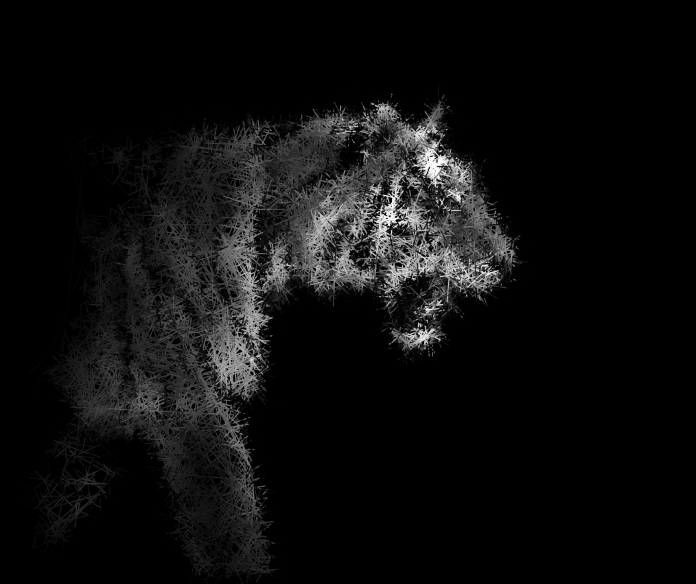

# 'the porcupine'
inspired by the bouncing dvd logo from that one office episode

particles bounce around within regions of images which are above a color threshold and also leaves a trail, resulting in a cool porcupine looking image which abstractly looks like the original provided image

example of a tiger drawing:

